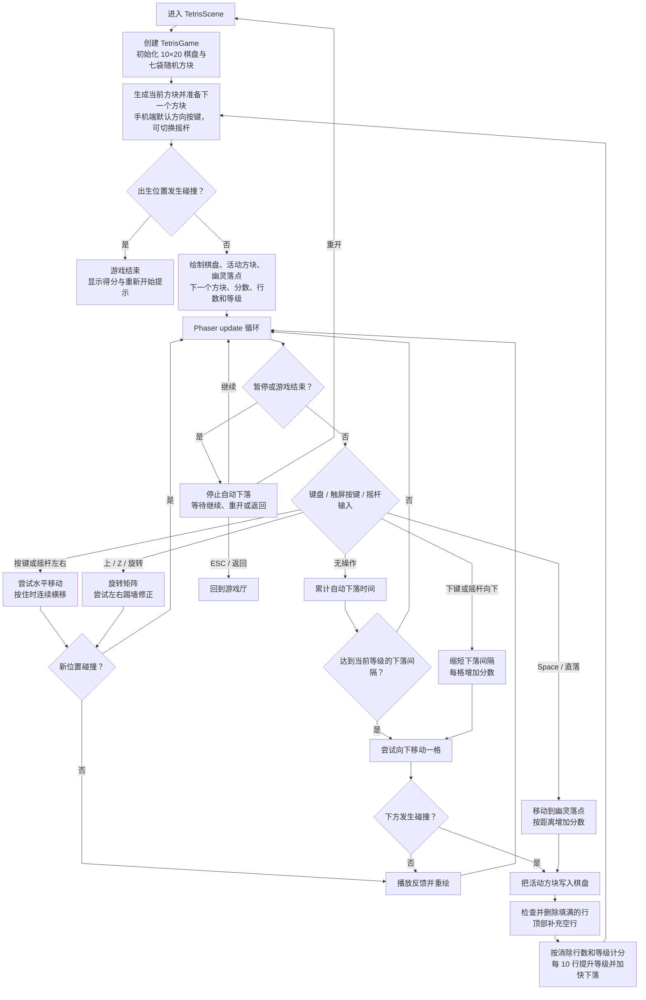
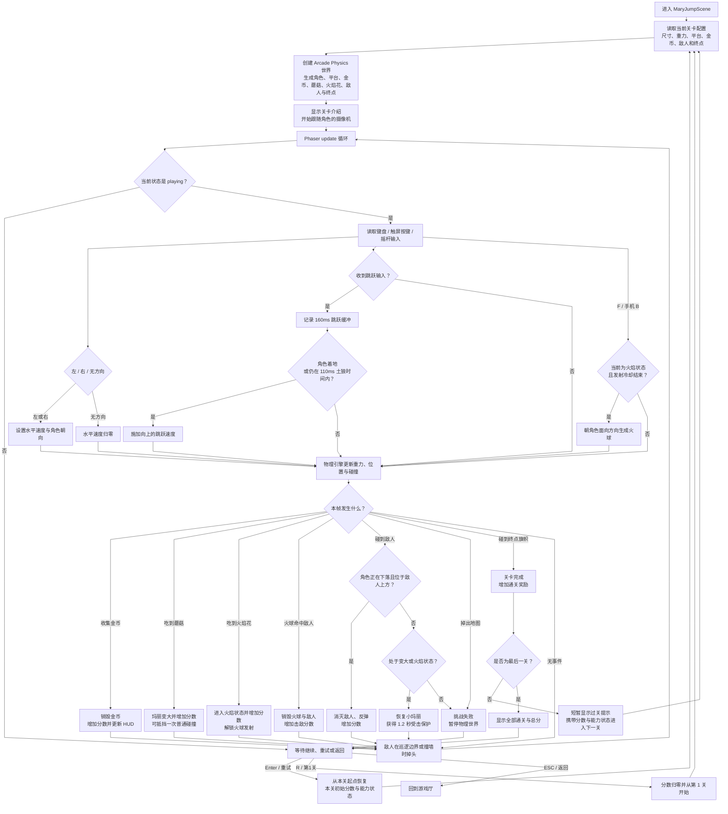
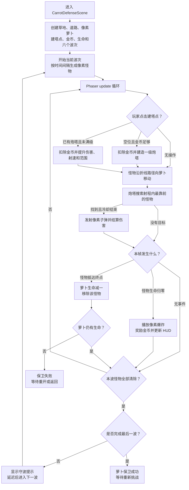
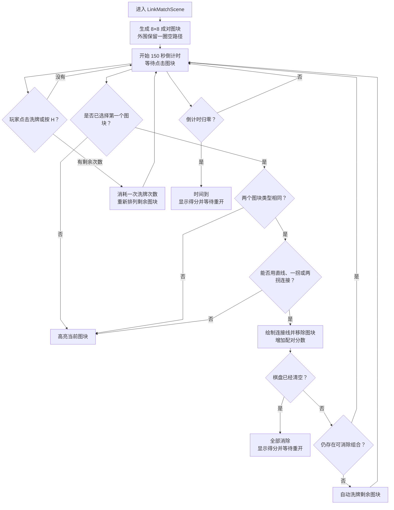
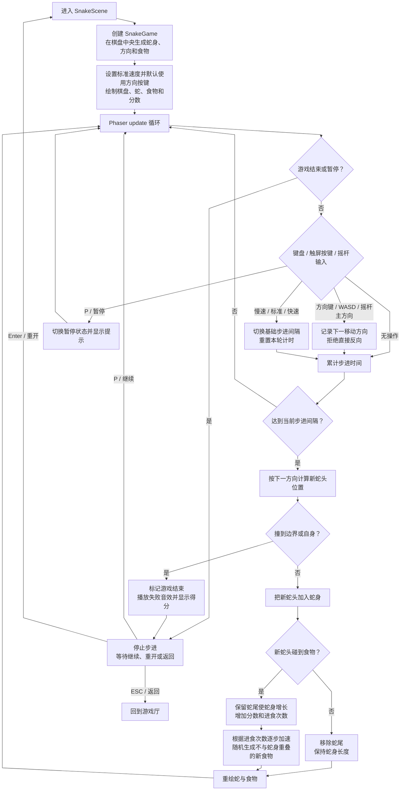
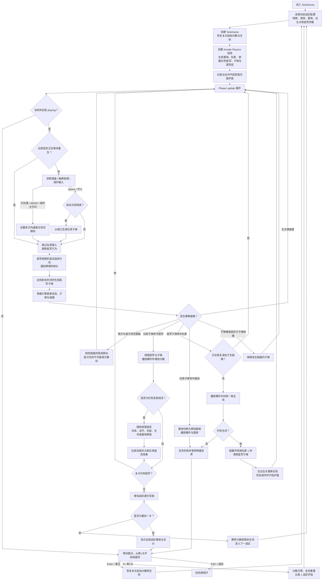

# Phaser 网页小游戏

基于 **Vite + Phaser 3 + 原生 JavaScript** 的纯网页小游戏合集，包含俄罗斯方块、贪吃蛇、玛丽跳跃、坦克大战、保卫萝卜和连连看。

## 运行

```bash
npm install
npm run dev
```

生产构建：

```bash
npm run build
```

游戏厅中使用方向键选择，按 `Enter` 进入，也可以按数字键 `1` 至 `4` 快速进入。游戏中按 `Esc` 返回游戏厅。

在手机或窄屏设备上，游戏画布下方会自动显示触摸控制面板和当前游戏的操作提示。**手机版仅支持竖屏游玩，请将手机保持为竖屏方向。**

- 俄罗斯方块：左右移动、软降、旋转、直落、暂停
- 贪吃蛇：四方向转向、暂停，并可选择慢速、标准、快速三档速度
- 玛丽跳跃：方向键或摇杆移动，支持普通跳、大跳和暂停
- 坦克大战：方向键或摇杆驾驶，按住开火、暂停
- 保卫萝卜：点击空地建造炮塔，再次点击升级，抵御六波像素怪物
- 连连看：点击两个相同图块，通过不超过两次转弯的路径连接消除

每款游戏都提供触摸“重开”和“返回”按钮。俄罗斯方块在手机上使用紧凑双栏布局：棋盘在左，标题、计分和下一个方块在右，通过压缩空白区域放大整体画面。

## 分层结构

```text
src/
├── audio/
│   └── SoundFX.js                  # Web Audio 程序化音效
├── ui/
│   └── MobileControls.js           # 手机触摸状态与场景控制绑定
├── game/                         # 不依赖 Phaser 画面的游戏规则层
│   ├── tetris/
│   │   ├── TetrisGame.js         # 棋盘、移动、旋转、消行、计分
│   │   └── config.js             # 七种方块与棋盘参数
│   ├── snake/
│   │   ├── SnakeGame.js          # 蛇移动、转向、食物、碰撞、成长
│   │   └── config.js             # 棋盘、速度和计分参数
│   ├── mary-jump/
│   │   ├── MaryJumpGame.js       # 得分、踩踏判断、胜负状态
│   │   └── config.js             # 平台、金币、敌人与关卡参数
│   ├── tank/
│   │   ├── TankGame.js           # 生命、计分、射击节流、敌人决策
│   │   └── config.js             # 地图、出生点、方向与数值配置
│   ├── carrot-defense/
│   │   ├── CarrotDefenseGame.js  # 金币、萝卜生命、炮塔和波次状态
│   │   └── config.js             # 道路、建塔点、敌人波次与数值配置
│   └── link-match/
│       ├── LinkMatchGame.js      # 成对棋盘、两拐点寻路、消除与洗牌
│       └── config.js             # 棋盘、图块、时间和计分参数
├── scenes/                       # Phaser 适配与表现层
│   ├── MenuScene.js              # 游戏厅菜单
│   ├── TetrisScene.js            # 俄罗斯方块输入与绘制
│   ├── SnakeScene.js             # 贪吃蛇输入与绘制
│   ├── MaryJumpScene.js          # 玛丽跳跃物理与绘制
│   ├── TankScene.js              # 坦克物理、碰撞与绘制
│   ├── CarrotDefenseScene.js     # 像素塔防、路径移动与炮塔射击
│   └── LinkMatchScene.js         # 图块点击、连接线、倒计时与洗牌
├── main.js                       # Phaser 初始化与场景注册
└── styles.css                    # 网页外壳样式
```

分层原则：`game/` 决定“游戏怎么算”，`scenes/` 决定“怎么接收输入、使用 Phaser 物理并显示出来”。

平台游戏与坦克大战的原创像素素材位于 `public/assets/`，保卫萝卜和连连看的图形由 Phaser 程序化像素绘制。六款游戏共用 `SoundFX.js` 提供的移动、旋转、吞食、跳跃、金币、射击、爆炸和胜负音效。

## 俄罗斯方块流程图



## 玛丽跳跃流程图



## 保卫萝卜流程图



## 连连看流程图



## 贪吃蛇流程图



## 坦克大战流程图



